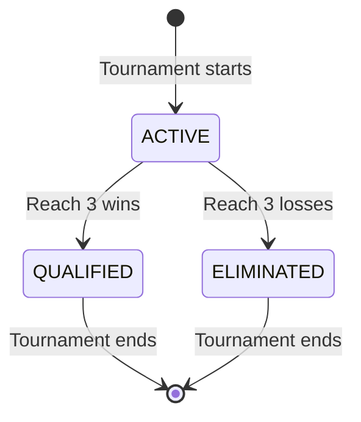

# Data Model: League of Legends Worlds Tournament Simulator

**Phase**: 1 (Design & Contracts)
**Date**: 2025-10-22
**Purpose**: Define entities, relationships, and domain rules

## Entity Definitions

### Team

**Purpose**: Represents a competitive League of Legends team participating in the tournament

**Properties**:
| Property | Type | Required | Description | Constraints |
|----------|------|----------|-------------|-------------|
| `id` | `string` | Yes | Unique identifier | UUID v4 format |
| `name` | `string` | Yes | Team display name | 1-50 characters |
| `region` | `Region` | Yes | Competitive region | Enum: LCK, LPL, LCP, LEC, LCS |
| `wins` | `number` | Yes | Number of wins in Swiss stage | 0-3 |
| `losses` | `number` | Yes | Number of losses in Swiss stage | 0-3 |
| `status` | `TeamStatus` | Yes | Current tournament status | Enum: ACTIVE, QUALIFIED, ELIMINATED |

**Derived Properties**:
- `record`: `string` - Formatted as "{wins}-{losses}" (e.g., "2-1")
- `recordBracket`: `string` - Same as record, used for grouping (e.g., "1-0")

**Business Rules**:
1. **Swiss Qualification**: Team with 3 wins MUST transition to QUALIFIED status
2. **Swiss Elimination**: Team with 3 losses MUST transition to ELIMINATED status
3. **Record Integrity**: `wins + losses <= 5` (maximum 5 Swiss matches before 3-0 or 0-3)
4. **Initial State**: All teams start with wins=0, losses=0, status=ACTIVE

**Example**:
```typescript
{
  id: "a1b2c3d4-e5f6-7890-abcd-ef1234567890",
  name: "T1",
  region: "LCK",
  wins: 2,
  losses: 1,
  status: "ACTIVE"  // Still in Swiss stage
}
```

---

### Match

**Purpose**: Represents a single game between two teams in either Swiss or Knockout stage

**Properties**:
| Property | Type | Required | Description | Constraints |
|----------|------|----------|-------------|-------------|
| `id` | `string` | Yes | Unique identifier | UUID v4 format |
| `team1Id` | `string` | Yes | First team ID | Must reference existing Team |
| `team2Id` | `string` | Yes | Second team ID | Must reference existing Team, != team1Id |
| `winnerId` | `string \| null` | No | Winner team ID | Must be team1Id or team2Id if resolved |
| `stage` | `StageType` | Yes | Tournament stage | Enum: SWISS, KNOCKOUT |
| `roundNumber` | `number` | Yes | Round within stage | Swiss: 1-5, Knockout: 1-3 |
| `recordBracket` | `string \| null` | No | Swiss record bracket | Required if stage=SWISS (e.g., "1-0") |
| `knockoutRound` | `KnockoutRound \| null` | No | Knockout round type | Required if stage=KNOCKOUT |
| `locked` | `boolean` | Yes | Whether match is locked for re-draw | Default: false |

**Business Rules**:
1. **Resolution**: Match considered resolved if `winnerId !== null`
2. **Swiss Record Constraint**: In Swiss stage, both teams MUST have same `recordBracket`
3. **No Repeat Matchups**: Teams cannot face each other more than once in Swiss stage
4. **Lock Behavior**: Locked matches MUST NOT change during phase re-draw
5. **Knockout Progression**: Winner advances, loser is eliminated

**Example (Swiss)**:
```typescript
{
  id: "m1234567-89ab-cdef-0123-456789abcdef",
  team1Id: "a1b2c3d4-e5f6-7890-abcd-ef1234567890",  // T1
  team2Id: "b2c3d4e5-f6a7-8901-bcde-f12345678901",  // G2
  winnerId: "a1b2c3d4-e5f6-7890-abcd-ef1234567890",  // T1 won
  stage: "SWISS",
  roundNumber: 2,
  recordBracket: "1-0",  // Both teams were 1-0
  knockoutRound: null,
  locked: false
}
```

**Example (Knockout)**:
```typescript
{
  id: "m9876543-21ba-fedc-0123-456789abcdef",
  team1Id: "a1b2c3d4-e5f6-7890-abcd-ef1234567890",  // T1 (3-0)
  team2Id: "c3d4e5f6-a7b8-9012-cdef-123456789012",  // FNC (3-2)
  winnerId: null,  // Not yet resolved
  stage: "KNOCKOUT",
  roundNumber: 1,
  recordBracket: null,
  knockoutRound: "QUARTERFINALS",
  locked: true  // User locked this matchup
}
```

---

### Round

**Purpose**: Groups matches that occur simultaneously in Swiss stage

**Properties**:
| Property | Type | Required | Description | Constraints |
|----------|------|----------|-------------|-------------|
| `id` | `string` | Yes | Unique identifier | UUID v4 format |
| `roundNumber` | `number` | Yes | Sequential round number | 1-5 for Swiss |
| `matchIds` | `string[]` | Yes | Match IDs in this round | 4-8 matches typically |
| `recordBrackets` | `string[]` | Yes | Record brackets in round | e.g., ["1-0", "0-1"] for Round 2 |

**Business Rules**:
1. **Round 1 Structure**: Always has 8 matches in "0-0" bracket
2. **Round 2+ Structure**: Multiple brackets based on current records
3. **Round Completion**: Round considered complete when all matches resolved
4. **Sequential Execution**: Round N+1 cannot start until Round N complete

**Example (Round 2)**:
```typescript
{
  id: "r2345678-90ab-cdef-0123-456789abcdef",
  roundNumber: 2,
  matchIds: [
    "m1111111-1111-1111-1111-111111111111",  // 1-0 bracket match 1
    "m2222222-2222-2222-2222-222222222222",  // 1-0 bracket match 2
    "m3333333-3333-3333-3333-333333333333",  // 1-0 bracket match 3
    "m4444444-4444-4444-4444-444444444444",  // 1-0 bracket match 4
    "m5555555-5555-5555-5555-555555555555",  // 0-1 bracket match 1
    "m6666666-6666-6666-6666-666666666666",  // 0-1 bracket match 2
    "m7777777-7777-7777-7777-777777777777",  // 0-1 bracket match 3
    "m8888888-8888-8888-8888-888888888888"   // 0-1 bracket match 4
  ],
  recordBrackets: ["1-0", "0-1"]
}
```

---

### Stage

**Purpose**: Represents a tournament phase (Swiss or Knockout)

**Properties**:
| Property | Type | Required | Description | Constraints |
|----------|------|----------|-------------|-------------|
| `type` | `StageType` | Yes | Stage type | Enum: SWISS, KNOCKOUT |
| `status` | `StageStatus` | Yes | Current stage status | Enum: NOT_STARTED, IN_PROGRESS, COMPLETED |
| `roundIds` | `string[]` | Yes | Rounds in this stage | Swiss: up to 5, Knockout: 3 |
| `currentRoundNumber` | `number \| null` | No | Active round | null if NOT_STARTED |

**Business Rules**:
1. **Swiss Completion**: Stage complete when 8 teams QUALIFIED and 8 ELIMINATED
2. **Knockout Completion**: Stage complete when 1 team remains (champion)
3. **Sequential Stages**: Knockout cannot start until Swiss complete
4. **Single Active Stage**: Only one stage can be IN_PROGRESS at a time

**Example (Swiss Stage)**:
```typescript
{
  type: "SWISS",
  status: "IN_PROGRESS",
  roundIds: [
    "r1111111-1111-1111-1111-111111111111",  // Round 1 (complete)
    "r2222222-2222-2222-2222-222222222222"   // Round 2 (in progress)
  ],
  currentRoundNumber: 2
}
```

**Example (Knockout Stage)**:
```typescript
{
  type: "KNOCKOUT",
  status: "IN_PROGRESS",
  roundIds: [
    "r3333333-3333-3333-3333-333333333333",  // Quarterfinals (complete)
    "r4444444-4444-4444-4444-444444444444"   // Semifinals (in progress)
  ],
  currentRoundNumber: 2
}
```

---

### TournamentState

**Purpose**: Root aggregate containing entire tournament state for persistence

**Properties**:
| Property | Type | Required | Description | Constraints |
|----------|------|----------|-------------|-------------|
| `version` | `string` | Yes | State schema version | Semantic versioning (e.g., "1.0.0") |
| `createdAt` | `Date` | Yes | Tournament creation timestamp | ISO 8601 format |
| `updatedAt` | `Date` | Yes | Last modification timestamp | ISO 8601 format |
| `teams` | `Team[]` | Yes | All 16 tournament teams | Exactly 16 teams |
| `matches` | `Match[]` | Yes | All matches (Swiss + Knockout) | Variable length |
| `rounds` | `Round[]` | Yes | All rounds | Variable length |
| `swissStage` | `Stage` | Yes | Swiss stage state | Type must be SWISS |
| `knockoutStage` | `Stage \| null` | No | Knockout stage state | null until Swiss complete |
| `drawAlgorithm` | `DrawAlgorithm` | Yes | Selected simulation algorithm | Enum: RANDOM, BIASED |
| `matchHistory` | `MatchHistory[]` | Yes | Past matchups for no-repeat rule | Array of team ID pairs |

**Business Rules**:
1. **Immutability**: Each state update creates new TournamentState (functional approach)
2. **Consistency**: All entity references must be valid (no dangling IDs)
3. **Version Compatibility**: State with different schema version rejected on load
4. **Persistence**: Entire state serialized to localStorage after each mutation
5. **Validation**: State validated on load (16 teams, no duplicate IDs, etc.)

**Example**:
```typescript
{
  version: "1.0.0",
  createdAt: "2025-10-22T10:00:00Z",
  updatedAt: "2025-10-22T10:30:00Z",
  teams: [ /* 16 team objects */ ],
  matches: [ /* match objects */ ],
  rounds: [ /* round objects */ ],
  swissStage: { type: "SWISS", status: "IN_PROGRESS", ... },
  knockoutStage: null,  // Swiss not complete yet
  drawAlgorithm: "BIASED",
  matchHistory: [
    { team1Id: "t1-id", team2Id: "g2-id" },  // T1 vs G2 in Round 1
    { team1Id: "t1-id", team2Id: "fnc-id" }  // T1 vs FNC in Round 2
  ]
}
```

---

## Enumerations

### Region

**Values**: `LCK | LPL | LCP | LEC | LCS`

**Descriptions**:
- `LCK`: Korea (highest strength: 100%)
- `LPL`: China (strength: 90%)
- `LCP`: Pacific (strength: 70%)
- `LEC`: Europe (strength: 60%)
- `LCS`: Americas (strength: 50%)

**Usage**: Determines biased draw win probability

---

### TeamStatus

**Values**: `ACTIVE | QUALIFIED | ELIMINATED`

**Transitions**:
- `ACTIVE → QUALIFIED`: Team reaches 3 wins in Swiss
- `ACTIVE → ELIMINATED`: Team reaches 3 losses in Swiss
- No reverse transitions (status changes are final)

---

### StageType

**Values**: `SWISS | KNOCKOUT`

**Descriptions**:
- `SWISS`: 16-team Swiss system (play until 3-0 or 0-3)
- `KNOCKOUT`: 8-team single-elimination bracket

---

### StageStatus

**Values**: `NOT_STARTED | IN_PROGRESS | COMPLETED`

**Transitions**:
- `NOT_STARTED → IN_PROGRESS`: First match in stage created
- `IN_PROGRESS → COMPLETED`: Stage completion criteria met

---

### DrawAlgorithm

**Values**: `RANDOM | BIASED`

**Descriptions**:
- `RANDOM`: Equal 50% win probability for all matchups
- `BIASED`: Regional strength-based probability using formula:
  ```
  P(Team1 wins) = Strength(Team1) / (Strength(Team1) + Strength(Team2))
  ```

---

### KnockoutRound

**Values**: `QUARTERFINALS | SEMIFINALS | FINALS`

**Match Counts**:
- `QUARTERFINALS`: 4 matches (8 teams → 4 winners)
- `SEMIFINALS`: 2 matches (4 teams → 2 winners)
- `FINALS`: 1 match (2 teams → 1 champion)

---

## Relationships

### Team ↔ Match

**Relationship**: Many-to-Many (via team1Id/team2Id foreign keys)

- A Team can participate in multiple Matches
- A Match involves exactly 2 Teams
- Navigable bidirectionally

**Invariant**: A team cannot face the same opponent more than once in Swiss stage

---

### Match ↔ Round

**Relationship**: Many-to-One (via Round.matchIds array)

- A Match belongs to exactly one Round
- A Round contains multiple Matches (typically 4-8)
- Navigable bidirectionally

**Invariant**: All matches in a Swiss round must have same recordBrackets

---

### Round ↔ Stage

**Relationship**: Many-to-One (via Stage.roundIds array)

- A Round belongs to exactly one Stage
- A Stage contains multiple Rounds (Swiss: up to 5, Knockout: 3)
- Navigable bidirectionally

**Invariant**: Rounds within a stage must have sequential roundNumber values

---

### Stage ↔ TournamentState

**Relationship**: One-to-One composition

- TournamentState owns exactly one swissStage
- TournamentState may own zero or one knockoutStage
- Lifecycle bound: Stages deleted when TournamentState deleted

**Invariant**: Only one stage can have status IN_PROGRESS at a time

---

## State Transitions

### Swiss Stage Flow

```
Initial State (Round 0):
  - 16 teams: all ACTIVE, 0-0 record
  - 0 matches

Round 1:
  - Create 8 matches (0-0 bracket)
  - Simulate or manually select winners
  - Update team records: winners → 1-0, losers → 0-1

Round 2:
  - Create 4 matches (1-0 bracket) + 4 matches (0-1 bracket)
  - Simulate or manually select winners
  - Update team records: 1-0 teams → 2-0 or 1-1, 0-1 teams → 1-1 or 0-2

Round 3:
  - Multiple brackets: 2-0, 1-1, 0-2
  - Some teams may reach 3-0 (QUALIFIED) or 0-3 (ELIMINATED)
  - Update statuses

Rounds 4-5:
  - Continue until 8 teams QUALIFIED and 8 ELIMINATED
  - Swiss stage status → COMPLETED
```

### Knockout Stage Flow

```
Initial State:
  - 8 qualified teams (seeded by record: 3-0, 3-1, 3-2)
  - Seeding rule: 3-0 vs 3-2, 3-1 vs 3-1 and remaining 3-2

Quarterfinals (Round 1):
  - 4 matches
  - 4 winners advance, 4 losers eliminated

Semifinals (Round 2):
  - 2 matches
  - 2 winners advance to finals, 2 losers eliminated

Finals (Round 3):
  - 1 match
  - 1 winner (champion), 1 loser (runner-up)
  - Knockout stage status → COMPLETED
```

### Team Status Transitions



## Validation Rules

### Team Validation

```typescript
function validateTeam(team: Team): ValidationResult {
  if (!team.id || !isUUID(team.id)) return error("Invalid team ID");
  if (!team.name || team.name.length === 0) return error("Team name required");
  if (team.name.length > 50) return error("Team name too long");
  if (!validRegions.includes(team.region)) return error("Invalid region");
  if (team.wins < 0 || team.wins > 3) return error("Wins out of range");
  if (team.losses < 0 || team.losses > 3) return error("Losses out of range");
  if (team.wins + team.losses > 5) return error("Too many total matches");

  // Status consistency
  if (team.wins === 3 && team.status !== "QUALIFIED") return error("3-0 must be qualified");
  if (team.losses === 3 && team.status !== "ELIMINATED") return error("0-3 must be eliminated");
  if (team.wins < 3 && team.losses < 3 && team.status !== "ACTIVE") return error("Must be active");

  return ok();
}
```

### Match Validation

```typescript
function validateMatch(match: Match, teams: Team[]): ValidationResult {
  if (!match.id || !isUUID(match.id)) return error("Invalid match ID");
  if (!teamExists(match.team1Id, teams)) return error("Team1 not found");
  if (!teamExists(match.team2Id, teams)) return error("Team2 not found");
  if (match.team1Id === match.team2Id) return error("Cannot match team with itself");

  if (match.winnerId !== null) {
    if (match.winnerId !== match.team1Id && match.winnerId !== match.team2Id) {
      return error("Winner must be one of the teams");
    }
  }

  if (match.stage === "SWISS" && !match.recordBracket) {
    return error("Swiss match requires record bracket");
  }

  if (match.stage === "KNOCKOUT" && !match.knockoutRound) {
    return error("Knockout match requires round type");
  }

  return ok();
}
```

### TournamentState Validation

```typescript
function validateTournamentState(state: TournamentState): ValidationResult {
  if (state.teams.length !== 16) return error("Must have exactly 16 teams");

  const teamIds = new Set();
  for (const team of state.teams) {
    if (teamIds.has(team.id)) return error("Duplicate team ID");
    teamIds.add(team.id);

    const result = validateTeam(team);
    if (!result.ok) return result;
  }

  // Validate qualified/eliminated counts
  const qualified = state.teams.filter(t => t.status === "QUALIFIED");
  const eliminated = state.teams.filter(t => t.status === "ELIMINATED");

  if (state.swissStage.status === "COMPLETED") {
    if (qualified.length !== 8) return error("Swiss must have 8 qualified");
    if (eliminated.length !== 8) return error("Swiss must have 8 eliminated");
  }

  // Validate all matches reference valid teams
  for (const match of state.matches) {
    const result = validateMatch(match, state.teams);
    if (!result.ok) return result;
  }

  return ok();
}
```

## Persistence Schema

**localStorage Key**: `worlds-tournament-state`

**Format**: JSON serialization of TournamentState

**Schema Version**: `1.0.0`

**Example Serialized State**:
```json
{
  "version": "1.0.0",
  "createdAt": "2025-10-22T10:00:00.000Z",
  "updatedAt": "2025-10-22T10:30:00.000Z",
  "drawAlgorithm": "BIASED",
  "teams": [
    {
      "id": "550e8400-e29b-41d4-a716-446655440000",
      "name": "T1",
      "region": "LCK",
      "wins": 2,
      "losses": 1,
      "status": "ACTIVE"
    }
    // ... 15 more teams
  ],
  "matches": [ /* ... */ ],
  "rounds": [ /* ... */ ],
  "swissStage": { /* ... */ },
  "knockoutStage": null,
  "matchHistory": [ /* ... */ ]
}
```

**Size Estimation**: ~50KB for complete tournament (well under localStorage 5MB limit)

## Summary

This data model provides:
- **Clear entity definitions** with properties, constraints, and business rules
- **Well-defined relationships** between entities
- **State transition diagrams** for tournament progression
- **Comprehensive validation rules** to ensure data integrity
- **Persistence schema** for localStorage serialization

All entities align with Clean Architecture principles (domain-first design) and support the functional requirements defined in the specification.
